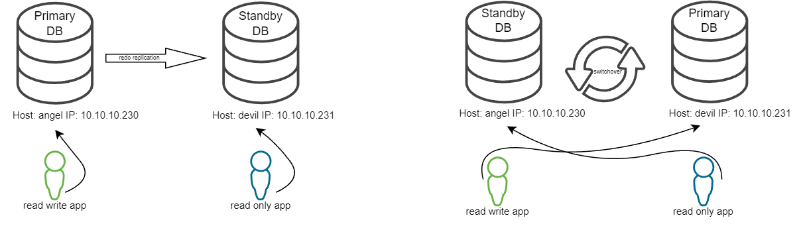
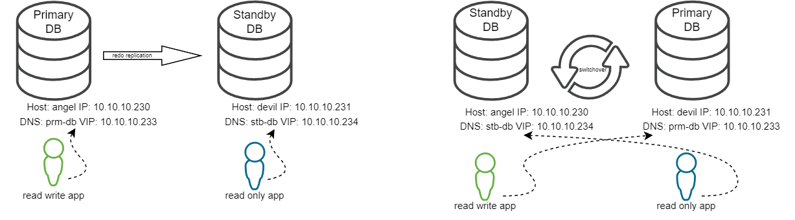

# Keepalived

**Keepalived** — ПО для обеспечения высокой доступности (high availabilitty) и балансировки нагрузки (load balancing) для Linux серверов.

**HA (high availabilitty)** реализован на базе протокола VRRP (Virtual Router Redundancy Protocol) и решает задачу доступности виртуального IP адреса (VIP).

**LB (load balancing)** реализован на базе IPVS (IP Virtual Server), механизма балансировки встроенного в ядро Linux, с его помощью решается задача балансировки нагрузки.

Мы будем использовать функционал высокой доступности keepalived, для решения задачи доступности БД по определенному адресу в зависимости от текущей роли БД (primary или standby). \
БД с ролью primary всегда будет доступна по VIP1, в то вермя как БД с ролью standby всегда будет доступна по VIP2. \
После операции switchover VIP1 автоматически поднимется на новом primary, а VIP2 на новом standby. \
Это дает возможность не менять строку подключения на стороне клиента в случае смены ролей БД.

Так же поставленная задача может быть реплизована с использованием решения описанного в \
How To Configure Client Failover For Data Guard Connections Using Database Services (Doc ID 1429223.1) \
Мы же рассматриваем случай когда количество клиентов велико и поменять у них строку подключения jdbc или tnsnames.ora проблематично.
Либо для приложений настройка которых проводится через инсталлятор и нельзя задать произвольную строку подключения к БД с указанием нескольких серверов.

<details><summary>As Is</summary>



* При смене ролей БД необходимо перенастраивать клиентов на подключение к новому серверу
* Клиенты которые подключались только на standby теперь подключаются на primary, тем самым создавая не запланированнную нагрузку
* Если клиенты имеют право подключения только на standby (триггер на профиль пользователя), то после смены ролей они будут получать ошибку пока не сменят строку подключения

</details>

<details><summary>To Be</summary>



* Каждый из серверов primary и standby имеет собственный VIP
* При смене ролей БД нужный VIP поднимается автоматически
* Не нужно менять строку подключения на клиентах, так как они настроены на "плавающий" VIP, который всегда соответствует роли БД

</details>

## Настройка keepalived

### 1. Установка

```shell
yum install -y keepalived
keepalived --version
systemctl status keepalived
```

### 2. Конфигурационные файлы

Переносим конфигурационные файлы из git проекта по соответствующим папкам

Если настраиваем в варианте двух зависимых экземпляров vrrp с ролями master и backup
Для primary
```shell
cp keepalived_prm.conf /etc/keepalived/keepalived.conf
```
Для standby
```shell
cp keepalived_stb.conf /etc/keepalived/keepalived.conf
```

Если настраиваем в варианте двух независимых экземпляров vrrp с ролью master
```shell
cp keepalived.conf /etc/keepalived/
```

```shell
chown root:root /etc/keepalived/keepalived.conf
chmod 644 /etc/keepalived/keepalived.conf

cp keepalived_notify.sh /usr/local/bin/
chown root:root /usr/local/bin/keepalived_notify.sh 
chmod 744 /usr/local/bin/keepalived_notify.sh

mkdir -p /home/oracle/maint/keepalived
chown oracle:oinstall /home/oracle/maint/keepalived

cp lsnr_restart.sh /home/oracle/maint/keepalived/
cp primary_check.sh /home/oracle/maint/keepalived/
cp standby_check.sh /home/oracle/maint/keepalived/
cp ora_env /home/oracle/maint/keepalived/

chown oracle:oinstall /home/oracle/maint/keepalived/lsnr_restart.sh
chown oracle:oinstall /home/oracle/maint/keepalived/primary_check.sh
chown oracle:oinstall /home/oracle/maint/keepalived/standby_check.sh
chown oracle:oinstall /home/oracle/maint/keepalived/ora_env

chmod 744 /home/oracle/maint/keepalived/lsnr_restart.sh
chmod 744 /home/oracle/maint/keepalived/primary_check.sh
chmod 744 /home/oracle/maint/keepalived/standby_check.sh
chmod 644 /home/oracle/maint/keepalived/ora_env
```

### 3. Добавляем в автозагрузку и запускаем

```shell
systemctl enable keepalived
systemctl start keepalived
systemctl status keepalived
ip a
```

### 4. Просмотр логов

```shell
journalctl -u keepalived -n20
```

## Проверка работы keepalived

### 1. Проверка адресов

```shell
cat /etc/hosts | egrep "angel19|devil19|prm-db|stb-db"

10.10.10.230 angel19 angel19.company.local
10.10.10.231 devil19 devil19.company.local
10.10.10.233 prm-db prm-db.company.local
10.10.10.234 stb-db stb-db.company.local
```

```shell
ip a | egrep "eth1$"
```

в выводе фиксируем по два адреса

для праймари
```shell
    inet 10.10.10.230/24 brd 10.10.10.255 scope global eth1
    inet 10.10.10.233/24 scope global secondary eth1
```

для стендбай
```shell
    inet 10.10.10.231/24 brd 10.10.10.255 scope global eth1
    inet 10.10.10.234/24 scope global secondary eth1
```

2. Проверка tnsnames.ora

```shell
vi $ORACLE_HOME/network/admin/tnsnames.ora

orcl_primary =
  (DESCRIPTION =
    (ADDRESS = (PROTOCOL = TCP)(HOST = prm-db)(PORT = 1521))
    (CONNECT_DATA = (SERVICE_NAME = keepalive_orcl))
  )

orcl_standby =
  (DESCRIPTION =
    (ADDRESS = (PROTOCOL = TCP)(HOST = stb-db)(PORT = 1521))
    (CONNECT_DATA = (SERVICE_NAME = keepalive_orcl))
  )
```

orcl_primary и orcl_standby записи ссылающиеся на vip адреса prm-db и stb-db соответственно 

убедимся что записи валидные для подключения

```shell
echo "select HOST_NAME from v\$instance;" | sqlplus -s system/<pass>@orcl_primary

HOST_NAME
---------
angel19

echo "select HOST_NAME from v\$instance;" | sqlplus -s system/<pass>@orcl_standby

HOST_NAME
---------
devil19

```

3. Открываем лог keepalived на обоих серверах

```shell
sudo journalctl -u keepalived -f
```

видим сообщение от службы каждые 5 сек

4. Смена ролей БД

```shell
dgmgrl /
connect sys
show configuration;
validate database orcl_angel19;
validate database orcl_devil19;
switchover to orcl_devil19;
show configuration;
```

5. Анализ лога keepalived на обоих серверах

```shell
sudo journalctl -u keepalived -n 1000 > out.txt
```

<details><summary>Лог бывшего праймари</summary>
<pre>
Dec 24 18:44:26 angel19 Keepalived_vrrp[1275]: /home/oracle/maint/keepalived/standby_check.sh exited with status 1 <b><-- так как роль БД primary, проверка standby_check возвращает ошибку</b>
Dec 24 18:44:31 angel19 Keepalived_vrrp[1275]: /home/oracle/maint/keepalived/standby_check.sh exited with status 1
Dec 24 18:44:36 angel19 Keepalived_vrrp[1275]: /home/oracle/maint/keepalived/standby_check.sh exited with status 1
Dec 24 18:44:41 angel19 Keepalived_vrrp[1275]: /home/oracle/maint/keepalived/standby_check.sh exited with status 1
Dec 24 18:44:46 angel19 Keepalived_vrrp[1275]: /home/oracle/maint/keepalived/standby_check.sh exited with status 1
Dec 24 18:44:52 angel19 Keepalived_vrrp[1275]: /home/oracle/maint/keepalived/primary_check.sh exited with status 255 <b><-- в момент смены ролей обе проверки</b> 
Dec 24 18:44:52 angel19 Keepalived_vrrp[1275]: /home/oracle/maint/keepalived/standby_check.sh exited with status 255 <b><-- возвращают код ошибки</b>
Dec 24 18:44:59 angel19 Keepalived_vrrp[1275]: /home/oracle/maint/keepalived/standby_check.sh exited with status 1
Dec 24 18:45:01 angel19 Keepalived_vrrp[1275]: /home/oracle/maint/keepalived/standby_check.sh exited with status 1
Dec 24 18:45:06 angel19 Keepalived_vrrp[1275]: /home/oracle/maint/keepalived/primary_check.sh exited with status 1
Dec 24 18:45:11 angel19 Keepalived_vrrp[1275]: /home/oracle/maint/keepalived/primary_check.sh exited with status 1
Dec 24 18:45:11 angel19 Keepalived_vrrp[1275]: VRRP_Script(primary_check) failed 
Dec 24 18:45:11 angel19 Keepalived_vrrp[1275]: VRRP_Script(standby_check) succeeded <b><-- смена ролей завершена, проверка standby_check теперь проходит успешно</b>
Dec 24 18:45:12 angel19 Keepalived_vrrp[1275]: VRRP_Instance(VIP_PRIMARY) Entering FAULT STATE
Dec 24 18:45:12 angel19 Keepalived_vrrp[1275]: VRRP_Instance(VIP_PRIMARY) removing protocol VIPs. <b><-- отключение vip адреса primary</b> 
Dec 24 18:45:12 angel19 Keepalived_vrrp[1275]: Opening script file /usr/local/bin/keepalived_notify.sh <b><-- вызов скрипта для рестарта листнера т.к. убрали ip</b>
Dec 24 18:45:12 angel19 Keepalived_vrrp[1275]: VRRP_Instance(VIP_PRIMARY) Now in FAULT state
Dec 24 18:45:12 angel19 su[55630]: (to oracle) root on none
Dec 24 18:45:13 angel19 Keepalived_vrrp[1275]: Kernel is reporting: interface eth1 UP
Dec 24 18:45:13 angel19 Keepalived_vrrp[1275]: VRRP_Instance(VIP_STANDBY): Transition to MASTER STATE
Dec 24 18:45:13 angel19 Keepalived_vrrp[1275]: VRRP_Instance(VIP_STANDBY) Transition to MASTER STATE
Dec 24 18:45:14 angel19 Keepalived_vrrp[1275]: VRRP_Instance(VIP_STANDBY) Entering MASTER STATE
Dec 24 18:45:14 angel19 Keepalived_vrrp[1275]: VRRP_Instance(VIP_STANDBY) setting protocol VIPs. <b><-- активация vip адреса standby</b>
Dec 24 18:45:14 angel19 Keepalived_vrrp[1275]: Sending gratuitous ARP on eth1 for 10.10.10.234
Dec 24 18:45:14 angel19 Keepalived_vrrp[1275]: VRRP_Instance(VIP_STANDBY) Sending/queueing gratuitous ARPs on eth1 for 10.10.10.234
Dec 24 18:45:14 angel19 Keepalived_vrrp[1275]: Sending gratuitous ARP on eth1 for 10.10.10.234
Dec 24 18:45:14 angel19 Keepalived_vrrp[1275]: Sending gratuitous ARP on eth1 for 10.10.10.234
Dec 24 18:45:14 angel19 Keepalived_vrrp[1275]: Sending gratuitous ARP on eth1 for 10.10.10.234
Dec 24 18:45:14 angel19 Keepalived_vrrp[1275]: Sending gratuitous ARP on eth1 for 10.10.10.234
Dec 24 18:45:14 angel19 Keepalived_vrrp[1275]: Opening script file /usr/local/bin/keepalived_notify.sh <b><-- вызов скрипта для рестарта листнера т.к. добавили ip</b>
Dec 24 18:45:14 angel19 su[55745]: (to oracle) root on none
Dec 24 18:45:16 angel19 Keepalived_vrrp[1275]: /home/oracle/maint/keepalived/primary_check.sh exited with status 1
Dec 24 18:45:19 angel19 Keepalived_vrrp[1275]: Sending gratuitous ARP on eth1 for 10.10.10.234
Dec 24 18:45:19 angel19 Keepalived_vrrp[1275]: VRRP_Instance(VIP_STANDBY) Sending/queueing gratuitous ARPs on eth1 for 10.10.10.234
Dec 24 18:45:19 angel19 Keepalived_vrrp[1275]: Sending gratuitous ARP on eth1 for 10.10.10.234
Dec 24 18:45:19 angel19 Keepalived_vrrp[1275]: Sending gratuitous ARP on eth1 for 10.10.10.234
Dec 24 18:45:19 angel19 Keepalived_vrrp[1275]: Sending gratuitous ARP on eth1 for 10.10.10.234
Dec 24 18:45:19 angel19 Keepalived_vrrp[1275]: Sending gratuitous ARP on eth1 for 10.10.10.234
Dec 24 18:45:21 angel19 Keepalived_vrrp[1275]: /home/oracle/maint/keepalived/primary_check.sh exited with status 1 <b><-- так как теперь роль БД standby, проверка primary_check возвращает ошибку</b>
Dec 24 18:45:26 angel19 Keepalived_vrrp[1275]: /home/oracle/maint/keepalived/primary_check.sh exited with status 1
Dec 24 18:45:31 angel19 Keepalived_vrrp[1275]: /home/oracle/maint/keepalived/primary_check.sh exited with status 1
</pre>
</details>

<details><summary>Лог бывшего стендбай</summary>
<pre>
Dec 24 18:44:15 devil19 Keepalived_vrrp[1285]: /home/oracle/maint/keepalived/primary_check.sh exited with status 1
Dec 24 18:44:20 devil19 Keepalived_vrrp[1285]: /home/oracle/maint/keepalived/primary_check.sh exited with status 1
Dec 24 18:44:25 devil19 Keepalived_vrrp[1285]: /home/oracle/maint/keepalived/primary_check.sh exited with status 1
Dec 24 18:44:30 devil19 Keepalived_vrrp[1285]: /home/oracle/maint/keepalived/primary_check.sh exited with status 1
Dec 24 18:44:35 devil19 Keepalived_vrrp[1285]: /home/oracle/maint/keepalived/primary_check.sh exited with status 1
Dec 24 18:44:41 devil19 Keepalived_vrrp[1285]: /home/oracle/maint/keepalived/primary_check.sh exited with status 255
Dec 24 18:44:41 devil19 Keepalived_vrrp[1285]: /home/oracle/maint/keepalived/standby_check.sh exited with status 255
Dec 24 18:44:45 devil19 Keepalived_vrrp[1285]: /home/oracle/maint/keepalived/standby_check.sh exited with status 1
Dec 24 18:44:45 devil19 Keepalived_vrrp[1285]: VRRP_Script(standby_check) failed
Dec 24 18:44:46 devil19 Keepalived_vrrp[1285]: VRRP_Instance(VIP_STANDBY) Entering FAULT STATE
Dec 24 18:44:46 devil19 Keepalived_vrrp[1285]: VRRP_Instance(VIP_STANDBY) removing protocol VIPs.
Dec 24 18:44:46 devil19 Keepalived_vrrp[1285]: Opening script file /usr/local/bin/keepalived_notify.sh
Dec 24 18:44:46 devil19 Keepalived_vrrp[1285]: VRRP_Instance(VIP_STANDBY) Now in FAULT state
Dec 24 18:44:46 devil19 su[57253]: (to oracle) root on none
Dec 24 18:44:50 devil19 Keepalived_vrrp[1285]: VRRP_Script(primary_check) succeeded
Dec 24 18:44:50 devil19 Keepalived_vrrp[1285]: /home/oracle/maint/keepalived/standby_check.sh exited with status 1
Dec 24 18:44:51 devil19 Keepalived_vrrp[1285]: VRRP_Instance(VIP_PRIMARY) Entering BACKUP STATE
Dec 24 18:44:51 devil19 Keepalived_vrrp[1285]: Opening script file /usr/local/bin/keepalived_notify.sh
Dec 24 18:44:51 devil19 su[57439]: (to oracle) root on none
Dec 24 18:44:55 devil19 Keepalived_vrrp[1285]: /home/oracle/maint/keepalived/standby_check.sh exited with status 1
Dec 24 18:45:00 devil19 Keepalived_vrrp[1285]: /home/oracle/maint/keepalived/standby_check.sh exited with status 1
Dec 24 18:45:05 devil19 Keepalived_vrrp[1285]: /home/oracle/maint/keepalived/standby_check.sh exited with status 1
Dec 24 18:45:10 devil19 Keepalived_vrrp[1285]: /home/oracle/maint/keepalived/standby_check.sh exited with status 1
Dec 24 18:45:12 devil19 Keepalived_vrrp[1285]: VRRP_Instance(VIP_PRIMARY) Transition to MASTER STATE
Dec 24 18:45:13 devil19 Keepalived_vrrp[1285]: VRRP_Instance(VIP_PRIMARY) Entering MASTER STATE
Dec 24 18:45:13 devil19 Keepalived_vrrp[1285]: VRRP_Instance(VIP_PRIMARY) setting protocol VIPs.
Dec 24 18:45:13 devil19 Keepalived_vrrp[1285]: Sending gratuitous ARP on eth1 for 10.10.10.233
Dec 24 18:45:13 devil19 Keepalived_vrrp[1285]: VRRP_Instance(VIP_PRIMARY) Sending/queueing gratuitous ARPs on eth1 for 10.10.10.233
Dec 24 18:45:13 devil19 Keepalived_vrrp[1285]: Sending gratuitous ARP on eth1 for 10.10.10.233
Dec 24 18:45:13 devil19 Keepalived_vrrp[1285]: Sending gratuitous ARP on eth1 for 10.10.10.233
Dec 24 18:45:13 devil19 Keepalived_vrrp[1285]: Sending gratuitous ARP on eth1 for 10.10.10.233
Dec 24 18:45:13 devil19 Keepalived_vrrp[1285]: Sending gratuitous ARP on eth1 for 10.10.10.233
Dec 24 18:45:13 devil19 Keepalived_vrrp[1285]: Opening script file /usr/local/bin/keepalived_notify.sh
Dec 24 18:45:13 devil19 su[57731]: (to oracle) root on none
Dec 24 18:45:15 devil19 Keepalived_vrrp[1285]: /home/oracle/maint/keepalived/standby_check.sh exited with status 1
Dec 24 18:45:18 devil19 Keepalived_vrrp[1285]: Sending gratuitous ARP on eth1 for 10.10.10.233
Dec 24 18:45:18 devil19 Keepalived_vrrp[1285]: VRRP_Instance(VIP_PRIMARY) Sending/queueing gratuitous ARPs on eth1 for 10.10.10.233
Dec 24 18:45:18 devil19 Keepalived_vrrp[1285]: Sending gratuitous ARP on eth1 for 10.10.10.233
Dec 24 18:45:18 devil19 Keepalived_vrrp[1285]: Sending gratuitous ARP on eth1 for 10.10.10.233
Dec 24 18:45:18 devil19 Keepalived_vrrp[1285]: Sending gratuitous ARP on eth1 for 10.10.10.233
Dec 24 18:45:18 devil19 Keepalived_vrrp[1285]: Sending gratuitous ARP on eth1 for 10.10.10.233
Dec 24 18:45:20 devil19 Keepalived_vrrp[1285]: /home/oracle/maint/keepalived/standby_check.sh exited with status 1
Dec 24 18:45:25 devil19 Keepalived_vrrp[1285]: /home/oracle/maint/keepalived/standby_check.sh exited with status 1
Dec 24 18:45:30 devil19 Keepalived_vrrp[1285]: /home/oracle/maint/keepalived/standby_check.sh exited with status 1
</pre>
</details>

6. Проверка подключения

Убедимся что не меняя настройки подключения мы попадаем на сервер БД с нужной нам ролью

```shell
echo "select HOST_NAME from v\$instance;" | sqlplus -s system/<pass>@orcl_primary

HOST_NAME
---------
devil19

echo "select HOST_NAME from v\$instance;" | sqlplus -s system/<pass>@orcl_standby

HOST_NAME
---------
angel19

```

## По итогам встречи 28.12.2024
### 1. Один экземпляр keepalive с настройками мастер, бэкап и один универсальный скрипт для проверки роли. 
Использование опции track_script не очень подробно документировано, но из всех примеров что мне удалось найти, я сделал вывод что скрипт всегда должен возвращать код 0 и тогда происходит поднятие VIP, в случае же если скрипт вернет любой код отличный от 0, то VIP убирается. Поэтому реализовать один универсальный скрипт для проверки роли нельзя.

### 2. Два экземпляра keepalive с настройками мастер, бэкап и два скрипта для проверки ролей.
Начальная реализация пердполагает использование двух независимых экземпляров vrrp с ролью master.
Альтернативный вариант использование двух зависимых экземпляров vrrp с ролями master и backup.

**Плюсы** 
* сервера знают о наличии партнёра, роль master выбирается не только по результатам работы track_script, но и с учетом доступности партнера и его приоритета
* не может быть ситуации когда один и тот же VIP поднимается на двух серверах, например после failover стал доступен старый primary

**Минусы**
* вместо универсального конфигурационного файла keepalived.conf на каждом сервере будет файл со своими значениями параметров state, priority, unicast_src_ip, unicast_peer

* в случае изменения реальных адресов серверов, требуется правка параметров unicast_src_ip, unicast_peer

**Важно**
в случае если произошёл failover, но после этого стал доступен старый primary и БД на нем будет запущена, то в таком случае VIP предназначенный для primary поднимется на нём так как у него в keepalived.conf прописано состояние MASTER и высший приоритет (в нашем случае priority 100). 
Что можно сделать (любой вариант): 
а. на новом primary сервере повысить приоитет, например priority 150, после изменения keepalived.conf перезапустить сервис keepalived
б. на старом primary остановить сервис keepalived

### 3. Потребление памяти за время работы keepalived?

Со временем работы keepalived видим увеличение значения Memory в выводе

```shell
systemctl status keepalived
```

Может сложиться впечатление, что со временем сервис использует всю доступню на хосте память.

Определимся с метриками потребления памяти процессами 

> Resident Memory - показывает сколько физической памяти потребляет процесс, колонки RSS / RES команд ps / top 

> Virtual Memory - показывает к какому объему памяти процесс может получить доступ в настоящий момент, колонки VSZ / VIRT команд ps / top

<details><summary>ps и top</summary>

```shell
ps aux | egrep '[k]eepalived|[V]SZ'
```

VSZ - virtual memory size of the process in KiB (1024-byte units)
RSS - resident set size, the non-swapped physical memory that a task has used (in kiloBytes)

```shell
top -o RES -c $(sudo pgrep keepalived | awk '{A = A " -p " $1} END {print A}')
```

VIRT  --  Virtual Memory Size (KiB)
          The  total  amount  of  virtual memory used by the task.  It includes all code, data and shared libraries plus pages that have been swapped out and pages that have been mapped but not used.

RES  --  Resident Memory Size (KiB)
         The non-swapped physical memory a task is using.

SHR  --  Shared Memory Size (KiB)
         The  amount of shared memory available to a task, not all of which is typically resident.  It simply reflects memory that could be potentially shared with other processes.

Соответствие парметров ps и top 
VSZ = VIRT
RSS = RES

</details>

Для мониторинга добавляем в crontab выполнение раз в час systemctl status и ps для отслеживания истории потребления памяти

```shell
0 * * * * systemctl status keepalived | egrep "Active|Memory" >> mem.log 2>&1
0 * * * * date >> ps_mem.log && ps aux | egrep '[k]eepalived|[V]SZ' >> ps_mem.log 2>&1
```

Из собранных логов видим, что со временем увеличивается Virtual Memory (память к которой процессы keepalived имеют доступ), в то время как Resident Memory (фактическое потребление процессами keepalived) с течением времени остаётся практически неизменной.

<details><summary>mem.log</summary>

```shell
for i in {1..7}; do egrep -A1 -m1 "$i day" mem.log; done

   Active: active (running) since Sat 2024-12-28 06:00:26 MSK; 1 day 1h ago
   Memory: 120.6M
   Active: active (running) since Sat 2024-12-28 06:00:26 MSK; 2 days ago
   Memory: 236.9M
   Active: active (running) since Sat 2024-12-28 06:00:26 MSK; 3 days ago
   Memory: 306.1M
   Active: active (running) since Sat 2024-12-28 06:00:26 MSK; 4 days ago
   Memory: 362.6M
   Active: active (running) since Sat 2024-12-28 06:00:26 MSK; 5 days ago
   Memory: 379.8M
   Active: active (running) since Sat 2024-12-28 06:00:26 MSK; 6 days ago
   Memory: 435.3M

for i in {0..7}; do egrep -A1 -m1 "weeks $i day" mem.log; done

   Active: active (running) since Sat 2024-12-28 06:00:26 MSK; 1 weeks 0 days ago
   Memory: 429.2M
   Active: active (running) since Sat 2024-12-28 06:00:26 MSK; 1 weeks 1 days ago
   Memory: 435.5M
   Active: active (running) since Sat 2024-12-28 06:00:26 MSK; 1 weeks 2 days ago
   Memory: 458.0M
   Active: active (running) since Sat 2024-12-28 06:00:26 MSK; 1 weeks 3 days ago
   Memory: 457.6M
   Active: active (running) since Sat 2024-12-28 06:00:26 MSK; 1 weeks 4 days ago
   Memory: 479.6M
   Active: active (running) since Sat 2024-12-28 06:00:26 MSK; 1 weeks 5 days ago
   Memory: 436.1M

```
</details>

<details><summary>ps_mem.log</summary>

```shell
egrep -A4 "09:00:[0-9][0-9] MSK" ps_mem.log | egrep -v "/bin/sh|systemctl"

Sun Dec 29 09:00:01 MSK 2024
USER        PID %CPU %MEM    VSZ   RSS TTY      STAT START   TIME COMMAND
root      23145  0.0  0.0 123032  1836 ?        Ss   Dec28   0:07 /usr/sbin/keepalived -D
--
Mon Dec 30 09:00:01 MSK 2024
USER        PID %CPU %MEM    VSZ   RSS TTY      STAT START   TIME COMMAND
root      23145  0.0  0.0 123032  1836 ?        Ss   Dec28   0:14 /usr/sbin/keepalived -D
root      23146  0.0  0.1 125156  7312 ?        S    Dec28   0:12 /usr/sbin/keepalived -D
root      23147  0.0  0.1 125156  6088 ?        S    Dec28   2:04 /usr/sbin/keepalived -D
--
Tue Dec 31 09:00:01 MSK 2024
USER        PID %CPU %MEM    VSZ   RSS TTY      STAT START   TIME COMMAND
root      23145  0.0  0.0 123032  1836 ?        Ss   Dec28   0:20 /usr/sbin/keepalived -D
root      23146  0.0  0.1 125156  7308 ?        S    Dec28   0:18 /usr/sbin/keepalived -D
root      23147  0.0  0.1 125156  6084 ?        S    Dec28   3:03 /usr/sbin/keepalived -D
--
Wed Jan  1 09:00:01 MSK 2025
USER        PID %CPU %MEM    VSZ   RSS TTY      STAT START   TIME COMMAND
root      23145  0.0  0.0 123032  1688 ?        Ss    2024   0:27 /usr/sbin/keepalived -D
root      23146  0.0  0.1 125156  7084 ?        S     2024   0:25 /usr/sbin/keepalived -D
root      23147  0.0  0.1 125156  5852 ?        S     2024   4:00 /usr/sbin/keepalived -D
--
Thu Jan  2 09:00:01 MSK 2025
USER        PID %CPU %MEM    VSZ   RSS TTY      STAT START   TIME COMMAND
root      23145  0.0  0.0 123032  1688 ?        Ss    2024   0:34 /usr/sbin/keepalived -D
root      23146  0.0  0.1 125156  7084 ?        S     2024   0:31 /usr/sbin/keepalived -D
--
Fri Jan  3 09:00:01 MSK 2025
USER        PID %CPU %MEM    VSZ   RSS TTY      STAT START   TIME COMMAND
root      23145  0.0  0.0 123032  1688 ?        Ss    2024   0:41 /usr/sbin/keepalived -D
root      23146  0.0  0.1 125156  7084 ?        S     2024   0:39 /usr/sbin/keepalived -D
root      23147  0.0  0.1 125156  5852 ?        S     2024   6:00 /usr/sbin/keepalived -D
--
Sat Jan  4 09:00:01 MSK 2025
USER        PID %CPU %MEM    VSZ   RSS TTY      STAT START   TIME COMMAND
root      23145  0.0  0.0 123032  1688 ?        Ss    2024   0:48 /usr/sbin/keepalived -D
root      23146  0.0  0.1 125156  7084 ?        S     2024   0:45 /usr/sbin/keepalived -D
root      23147  0.0  0.1 125156  5852 ?        S     2024   6:57 /usr/sbin/keepalived -D
--
Sun Jan  5 09:00:01 MSK 2025
USER        PID %CPU %MEM    VSZ   RSS TTY      STAT START   TIME COMMAND
root      23145  0.0  0.0 123032  1688 ?        Ss    2024   0:56 /usr/sbin/keepalived -D
root      23146  0.0  0.1 125156  7084 ?        S     2024   0:52 /usr/sbin/keepalived -D
root      23147  0.0  0.1 125156  5876 ?        S     2024   7:54 /usr/sbin/keepalived -D
--
Mon Jan  6 09:00:01 MSK 2025
USER        PID %CPU %MEM    VSZ   RSS TTY      STAT START   TIME COMMAND
root      23145  0.0  0.0 123032  1688 ?        Ss    2024   1:03 /usr/sbin/keepalived -D
root      23146  0.0  0.1 125156  7084 ?        S     2024   1:00 /usr/sbin/keepalived -D
root      23147  0.0  0.1 125156  5876 ?        S     2024   8:53 /usr/sbin/keepalived -D
--
Tue Jan  7 09:00:01 MSK 2025
USER        PID %CPU %MEM    VSZ   RSS TTY      STAT START   TIME COMMAND
root      23145  0.0  0.0 123032  1688 ?        Ss    2024   1:09 /usr/sbin/keepalived -D
root      23146  0.0  0.1 125156  7084 ?        S     2024   1:07 /usr/sbin/keepalived -D
root      23147  0.0  0.1 125156  5876 ?        S     2024   9:53 /usr/sbin/keepalived -D
--
Wed Jan  8 09:00:01 MSK 2025
USER        PID %CPU %MEM    VSZ   RSS TTY      STAT START   TIME COMMAND
root      23145  0.0  0.0 123032  1688 ?        Ss    2024   1:16 /usr/sbin/keepalived -D
root      23146  0.0  0.1 125156  7084 ?        S     2024   1:14 /usr/sbin/keepalived -D
root      23147  0.0  0.1 125156  5876 ?        S     2024  10:55 /usr/sbin/keepalived -D

```
</details>

### 4. ora_env чтобы формировался динамически 
Доработаны скрипты primary_check.sh и standby_check.sh
Файл ora_env формируется динамически на основе переменных из bash_profile